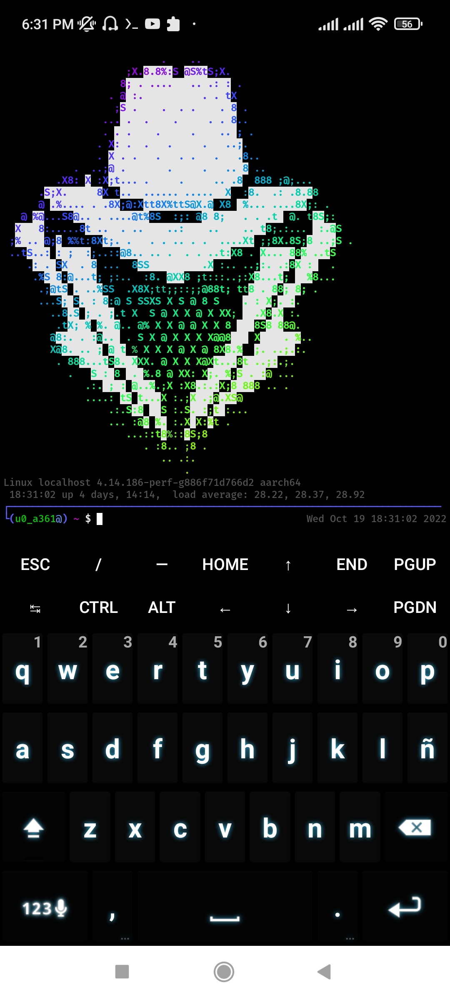

<div align="center">



# 🪽 BIENVENIDO AL VACÍO DE LA CIBERSEGURIDAD 🪽

---

### 🥀 GÓTICO // GRUNGE // UNDERGROUND 🥀
*"Explorando las sombras del código y la tecnología..."*

</div>

## 🌑 SOBRE SOCIETYSPY

**SocietySpy** es una suite de herramientas de ciberseguridad de código abierto, diseñada para auditar, penetrar y analizar entornos digitales. Inspirada en la estética oscura y la eficiencia, esta herramienta te permite explorar las profundidades de la seguridad informática directamente desde tu dispositivo Android a través de Termux, sin necesidad de acceso root.

### 💀 MI STACK & VIBE

*   **Estilo**: Grayscale / Gothic / Angel Wings
*   **Enfoque**: Desarrollo de herramientas de ciberseguridad y estética digital.
*   **Misión**: Proporcionar un entorno robusto y accesible para la exploración de vulnerabilidades.

---

## ✨ CARACTERÍSTICAS PRINCIPALES

*   **Amplia Colección de Herramientas:** Integra una vasta selección de utilidades para diversas tareas de ciberseguridad.
*   **Fácil Instalación y Gestión:** Un script de instalación simplificado que maneja automáticamente las dependencias.
*   **Entorno Termux Optimizado:** Diseñado específicamente para funcionar sin problemas en Termux (Android sin root).
*   **Actualizaciones Constantes:** Mantente al día con las últimas herramientas y mejoras.
*   **Comunidad Activa:** Soporte y desarrollo impulsado por la comunidad.

## 🚀 REQUISITOS

Para garantizar el funcionamiento óptimo de SocietySpy, asegúrate de cumplir con los siguientes requisitos:

*   **Aplicación Termux Actualizada:** Es crucial utilizar la versión más reciente de Termux desde F-Droid.
*   **Android 9 o Superior:** Compatibilidad garantizada con versiones modernas de Android.
*   **Al menos 100MB de Almacenamiento Disponible:** Para la instalación de herramientas y dependencias.

### ⚠️ Nota Importante sobre Termux

No se recomienda utilizar la aplicación Termux disponible en la "Google Play Store", ya que los desarrolladores ya no le dan mantenimiento y está desactualizada. Termux sigue recibiendo actualizaciones en la plataforma "F-Droid". Descarga la aplicación desde el siguiente enlace oficial:

[**Descargar Termux desde F-Droid**](https://f-droid.org/en/packages/com.termux)

## ⚙️ INSTALACIÓN

Sigue estos sencillos pasos para instalar SocietySpy en tu entorno Termux:

1.  **Actualizar Repositorios de Termux:**
    ```bash
    yes|pkg update && yes|pkg upgrade
    ```
2.  **Otorgar Permisos de Almacenamiento:**
    ```bash
    termux-setup-storage
    ```
3.  **Instalar Git:**
    ```bash
    yes|pkg install git
    ```
4.  **Clonar el Repositorio de SocietySpy:**
    ```bash
    git clone https://github.com/Darkmux/societyspy.git
    ```
5.  **Acceder a la Carpeta del Proyecto:**
    ```bash
    cd societyspy
    ```
6.  **Otorgar Permisos de Ejecución:**
    ```bash
    chmod 777 *.sh
    ```
7.  **Ejecutar el Instalador:**
    ```bash
bash societyspy.sh
    ```

## 💡 USO

El comando principal para interactuar con SocietySpy es `spy`. Aquí te mostramos cómo utilizarlo con sus argumentos:

*   **Ayuda:** Muestra un menú de ayuda con información sobre el uso de SocietySpy.
    ```bash
    spy help
    ```
*   **Listar Herramientas/Banners:** Muestra una lista de las herramientas, banners o prompts disponibles.
    ```bash
    spy list <tools|banners|prompts>
    ```
*   **Actualizar SocietySpy:** Busca y actualiza SocietySpy a su última versión. (Se recomienda ejecutarlo regularmente).
    ```bash
    spy update
    ```
*   **Desinstalar SocietySpy:** Desinstala completamente SocietySpy y restaura la configuración predeterminada de Termux.
    ```bash
    spy uninstall
    ```
*   **Cambiar Estilo:** Cambia el tamaño del banner o prompt. (Ajusta según el tamaño de tu fuente en Termux).
    ```bash
    spy style <banner|prompt>
    ```
*   **Instalar Herramienta:** Instala una herramienta específica.
    ```bash
    spy install <nombre_herramienta>
    ```
*   **Eliminar Herramienta:** Elimina una herramienta específica.
    ```bash
    spy remove <nombre_herramienta>
    ```
*   **Reinstalar Herramienta:** Reinstala una herramienta específica.
    ```bash
    spy reinstall <nombre_herramienta>
    ```

## 🛠️ HERRAMIENTAS INCLUIDAS

SocietySpy viene precargado con una impresionante colección de herramientas, y se han añadido las siguientes para expandir aún más sus capacidades:

*   `404Frame-main`
*   `AdminHack-main`
*   `All-in-One-main`
*   `AllHackingTools-main`
*   `AnonGT-main`
*   `Bl4ckZ3r0-main`
*   `Cracker-Tool-main`
*   `Cyber-Sploit-master`
*   `CyberPhish-master`
*   `DDoS-Ripper-main`
*   `Deface-main`
*   `Destroyer-main`
*   `Doxxer-Toolkit-main`
*   `FB-HACK-main`
*   `FSOCIETY-main`
*   `Faker-master`
*   `Free-Proxy-main`
*   `FuckYou-main`
*   `GhostTrack-main`
*   `HXP-Ducky-Master`
*   `IP-Tracer-master`
*   `Kali-Linux-main`
*   `L0p4Map-main`
*   `PingRAT-main`
*   `Python-Botnet-master`
*   `Python-RAT-main`
*   `Raven-Storm-master`
*   `SocialBox-Termux-master`
*   `SocialPwned-master`
*   `The_Extractor.py-main`
*   `TorMux-main`
*   `UniTools-Termux-main`
*   `WhatsAppHacking-main`
*   `Wifi-crackerX-main`
*   `Xteam-main`
*   `ZeroTermux-main`
*   `Zip-Cracker--master`
*   `advanced-bruteforce-password-generator-main`
*   `brute-eagle-main`
*   `brutus-main`
*   `gobuster-master`
*   `hackingtool-master`
*   `infect-master`
*   `instabrute.github.io-master`
*   `malicious-pdf-main`
*   `maskphish-master`
*   `mosint-master`
*   `passlord-main`
*   `peniot-master`
*   `ronin-main`
*   `toxssin-main`
*   `ufonet-master`
*   `vulscanpro-main`
*   `worm-main`
*   `zphishing-master`

## 🔗 CONECTA CON LA COMUNIDAD

<div align="center">


</div>

---

## 🤝 CONTRIBUCIÓN

¡Tu contribución es bienvenida! Si deseas mejorar SocietySpy, añadir nuevas herramientas o corregir errores, no dudes en:

1.  Hacer un fork del repositorio.
2.  Crear una nueva rama (`git checkout -b feature/nueva-funcionalidad`).
3.  Realizar tus cambios y hacer commit (`git commit -am 'Añadir nueva funcionalidad'`).
4.  Subir tus cambios (`git push origin feature/nueva-funcionalidad`).
5.  Abrir un Pull Request.

## 📄 LICENCIA

Este proyecto está bajo la Licencia Pública General (GPL). Consulta el archivo `LICENSE` para más detalles.

## 👤 CONTACTO

Desarrollado por: moisesgood4-bip y la comunidad SocietySpy


---

<div align="center">
  
  <br>
  
</div>
